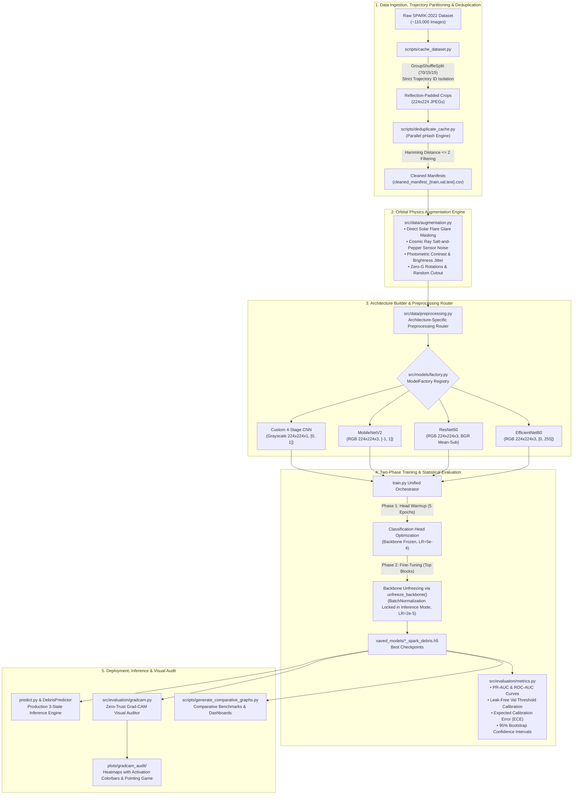

# 🛰️ Space Debris Identification System — Advanced Orbital Computer Vision

[](https://www.python.org/)
[](https://www.tensorflow.org/)
[](https://opencv.org/)
[](https://www.docker.com/)
[](tests/)
[](https://developer.nvidia.com/cuda-toolkit)
[](LICENSE)

A production-grade Deep Learning & Computer Vision pipeline engineered to classify orbital space domain imagery into **Space Debris** (rocket bodies, structural fragments, mission-related debris) vs. **Non-Debris (Active Satellites & Spacecraft)** using the ESA / Stanford SPARK-2022 dataset (~110,000 images).

Engineered with zero-I/O bottleneck cached streaming, Group-Based trajectory splitting, multi-core perceptual hash (`pHash`) deduplication, harsh space-domain physics augmentations, architecture-specific tensor routing, two-phase transfer learning with Batch Normalization inference locking, leak-free validation threshold calibration, confidence calibration (ECE & Brier score), and Zero-Trust Grad-CAM visual auditing.

---

## 📑 Table of Contents

- [🛰️ System Architecture & Workflow](#️-system-architecture--workflow)
- [📌 Key Engineering Innovations & Technical Solutions](#-key-engineering-innovations--technical-solutions)
  - [1. Trajectory-Based Group Splitting (Zero-Leakage Guarantee)](#1-trajectory-based-group-splitting-zero-leakage-guarantee)
  - [2. Multi-Core Perceptual Hash Deduplication (`pHash`)](#2-multi-core-perceptual-hash-deduplication-phash)
  - [3. Harsh Space-Domain Physics Augmentation Engine](#3-harsh-space-domain-physics-augmentation-engine)
  - [4. Architecture-Specific Tensor Normalization Routing](#4-architecture-specific-tensor-normalization-routing)
  - [5. Two-Phase Transfer Learning with Unified BN Inference Locking](#5-two-phase-transfer-learning-with-unified-bn-inference-locking)
  - [6. Multi-Metric Model Compilation & Safety-Critical Metrics](#6-multi-metric-model-compilation--safety-critical-metrics)
  - [7. Leak-Free Precision-Recall Threshold Calibration](#7-leak-free-precision-recall-threshold-calibration)
  - [8. Confidence Calibration (ECE, Brier Score & Reliability Diagrams)](#8-confidence-calibration-ece-brier-score--reliability-diagrams)
  - [9. Quantitative Explainability & Attention Audit (Pointing Game & IoU)](#9-quantitative-explainability--attention-audit-pointing-game--iou)
  - [10. Calibrated 3-State Uncertainty Decision Policy](#10-calibrated-3-state-uncertainty-decision-policy)
- [🧠 Supported Architectures & Verified Benchmark Results](#-supported-architectures--verified-benchmark-results)
  - [Architectural Specifications](#architectural-specifications)
  - [Empirical Benchmark Comparison](#empirical-benchmark-comparison)
- [📂 Repository Directory Structure](#-repository-directory-structure)
- [⚙️ Prerequisites & Environment Setup](#️-prerequisites--environment-setup)
  - [Local Installation (Conda / Virtualenv)](#local-installation-conda--virtualenv)
  - [Docker GPU Containerization](#docker-gpu-containerization)
- [🚀 End-to-End Execution Guide](#-end-to-end-execution-guide)
  - [Step 1: Offline Dataset Caching & Automated Deduplication](#step-1-offline-dataset-caching--automated-deduplication)
  - [Step 2: Standalone Parallel Perceptual Deduplication](#step-2-standalone-parallel-perceptual-deduplication)
  - [Step 3: Unified Model Training Pipeline](#step-3-unified-model-training-pipeline)
  - [Step 4: Comparative Analytics & Graph Generation](#step-4-comparative-analytics--graph-generation)
  - [Step 5: Production Inference (with 3-State Uncertainty Flagging)](#step-5-production-inference-with-3-state-uncertainty-flagging)
  - [Step 6: Zero-Trust Grad-CAM Visual Audit](#step-6-zero-trust-grad-cam-visual-audit)
  - [Step 7: Automated Scientific Test Suite](#step-7-automated-scientific-test-suite)
- [⚙️ Configuration Reference (`base_config.yaml`)](#️-configuration-reference-base_configyaml)
- [📜 License & Acknowledgments](#-license--acknowledgments)

---

## 🛰️ System Architecture & Workflow

The end-to-end data engineering, training, inference, and audit pipeline is depicted below:



---

## 📌 Key Engineering Innovations & Technical Solutions

### 1. Trajectory-Based Group Splitting (Zero-Leakage Guarantee)
- **The Challenge**: The SPARK-2022 dataset consists of continuous video trajectories of orbital targets. A naive random train/test split scatters consecutive, highly correlated frames of the same rotating spacecraft across train and test sets, yielding artificially inflated metrics (e.g., false 1.00 AUC) that fail under real mission conditions.
- **The Solution**: Implemented [`split_dataset_by_trajectory()`](file:///D:/Space-VS/Space-Derbis-Identification/src/data/loader.py) in [`src/data/loader.py`](file:///D:/Space-VS/Space-Derbis-Identification/src/data/loader.py) using `GroupShuffleSplit` from `scikit-learn`. Grouping records strictly by sequence trajectory IDs (`extract_trajectory_id()`) guarantees a strict **70% Train / 15% Validation / 15% Test** partition where zero trajectories in the training split exist in validation or test:
  $$\text{Trajectories}(\mathcal{D}_{\text{train}}) \cap \text{Trajectories}(\mathcal{D}_{\text{val}}) = \emptyset, \quad \text{Trajectories}(\mathcal{D}_{\text{train}}) \cap \text{Trajectories}(\mathcal{D}_{\text{test}}) = \emptyset$$

### 2. Multi-Core Perceptual Hash Deduplication (`pHash`)
- **The Challenge**: Spacecraft rendering pipelines produce near-identical "frozen" frames across video segments, skewing class distributions, bloating training memory, and causing catastrophic over-fitting.
- **The Solution**: Developed a parallel deduplication engine in [`scripts/deduplicate_cache.py`](file:///D:/Space-VS/Space-Derbis-Identification/scripts/deduplicate_cache.py) using `imagehash` (pHash) and `ProcessPoolExecutor`. It computes 64-bit perceptual image hashes across splits in parallel, filters consecutive intra-class frames with Hamming distance $\le 2$, and exports verified manifests (`cleaned_manifest_train.csv`, `cleaned_manifest_val.csv`, `cleaned_manifest_test.csv`). This process is also integrated directly into the caching workflow via [`scripts/cache_dataset.py`](file:///D:/Space-VS/Space-Derbis-Identification/scripts/cache_dataset.py).

### 3. Harsh Space-Domain Physics Augmentation Engine
- **The Challenge**: Standard ImageNet augmentations (Gaussian blur, color jitter) do not reflect orbital physics: vacuum illumination, cosmic radiation, and unattenuated solar radiation.
- **The Solution**: Engineered TensorFlow graph-compatible (`@tf.function`) augmentations in [`src/data/augmentation.py`](file:///D:/Space-VS/Space-Derbis-Identification/src/data/augmentation.py):
  - **Extreme Solar Glare**: Simulates direct solar flares without atmospheric scattering using exponential radial intensity masks:
    $$I_{\text{glare}}(x, y) = I_0 \cdot \exp\left(-\frac{(x - x_0)^2 + (y - y_0)^2}{2\sigma^2}\right)$$
  - **Sensor Noise**: Injects Salt-and-Pepper radiation noise simulating cosmic ray strikes on spaceborne CCD/CMOS optical sensors.
  - **Photometric Jitter**: Randomized contrast and brightness shifts simulating high dynamic range orbital lighting.
  - **Zero-G Spatial Invariance**: Full 90°/180° rotations and dual-axis spatial reflections.
  - **Random Cutout**: Prevents convolutional backbones from memorizing background borders or sensor artifacts.

### 4. Architecture-Specific Tensor Normalization Routing
- **The Challenge**: Feeding identically normalized `[0, 1]` tensors to backbones with disparate pretrained expectations (e.g., MobileNet expects `[-1, 1]`, ResNet expects BGR with ImageNet mean subtraction, EfficientNet has internal rescaling) leads to silent feature degradation.
- **The Solution**: Built a dedicated preprocessing router [`apply_architecture_preprocessing()`](file:///D:/Space-VS/Space-Derbis-Identification/src/data/preprocessing.py) in [`src/data/preprocessing.py`](file:///D:/Space-VS/Space-Derbis-Identification/src/data/preprocessing.py):
  - **Custom CNN**: Grayscale normalized strictly to `[0.0, 1.0]`.
  - **MobileNetV2**: RGB scaled to `[-1.0, 1.0]` (`mobilenet_v2.preprocess_input`).
  - **ResNet50**: ImageNet BGR conversion & mean subtraction (`resnet50.preprocess_input`).
  - **EfficientNetB0**: Preserves raw `[0.0, 255.0]` float32 tensor (handled by native internal rescaling layers).

### 5. Two-Phase Transfer Learning with Unified BN Inference Locking
- **The Challenge**: Fine-tuning pretrained backbones on small or imbalanced space domain datasets without proper warmup destroys pretrained weights. Crucially, allowing Batch Normalization (BN) layers to update their moving statistics during fine-tuning on small space batches destabilizes early feature representations and destroys pretrained knowledge.
- **The Solution**: Built a unified architecture-aware backbone unfreezer [`unfreeze_backbone()`](file:///D:/Space-VS/Space-Derbis-Identification/src/models/__init__.py) in [`src/models/__init__.py`](file:///D:/Space-VS/Space-Derbis-Identification/src/models/__init__.py) and implemented a two-phase training protocol in [`train.py`](file:///D:/Space-VS/Space-Derbis-Identification/train.py):
  - **Phase 1 (Head Warmup)**: Backbone frozen (`trainable = False`), optimizing only the Dense classification head with $\text{LR} = 5 \times 10^{-4}$.
  - **Phase 2 (Backbone Fine-Tuning)**: Selectively unfreezes top architectural blocks (`conv5` for ResNet-50, top 2 inverted residual blocks for MobileNetV2 / EfficientNet-B0), while **recursively traversing all sub-layers and locking every `tf.keras.layers.BatchNormalization` layer in inference mode (`trainable = False`)**, trained with reduced $\text{LR} = 2 \times 10^{-5}$.

### 6. Multi-Metric Model Compilation & Safety-Critical Metrics
- **The Challenge**: For safety-critical space debris avoidance, reporting solely overall accuracy is misleading because false negatives (misclassifying a high-velocity fragment as active craft or missing it entirely) are catastrophic.
- **The Solution**: In [`src/models/factory.py`](file:///D:/Space-VS/Space-Derbis-Identification/src/models/factory.py) and [`train.py`](file:///D:/Space-VS/Space-Derbis-Identification/train.py), models are compiled with comprehensive tracking metrics:
  - Accuracy
  - Precision (`tf.keras.metrics.Precision`)
  - Recall / Sensitivity (`tf.keras.metrics.Recall`)
  - Precision-Recall Area Under Curve (`tf.keras.metrics.AUC(curve='PR')`)
  - Receiver Operating Characteristic (`tf.keras.metrics.AUC(curve='ROC')`)
  
  During evaluation in [`src/evaluation/metrics.py`](file:///D:/Space-VS/Space-Derbis-Identification/src/evaluation/metrics.py), the system elevates **PR-AUC** and **Debris Recall** as primary headline safety metrics.

### 7. Leak-Free Precision-Recall Threshold Calibration
- **The Challenge**: Tuning decision thresholds directly on test data introduces critical test-set leakage, artificially inflating reported test metrics.
- **The Solution**: Implemented [`find_optimal_threshold()`](file:///D:/Space-VS/Space-Derbis-Identification/src/evaluation/metrics.py) in [`src/evaluation/metrics.py`](file:///D:/Space-VS/Space-Derbis-Identification/src/evaluation/metrics.py). The optimal decision threshold $\tau^*$ is discovered strictly on the **Validation split** by maximizing validation F1-score:
  $$\tau^* = \arg\max_{\tau \in (0, 1)} F_1(\tau; \mathcal{D}_{\text{val}})$$
  This threshold is **frozen** and directly applied to the held-out **Test split**, eliminating test leakage and ensuring scientific validity.

### 8. Confidence Calibration (ECE, Brier Score & Reliability Diagrams)
- **The Challenge**: Deep neural networks frequently produce overconfident probability estimates that misrepresent the true likelihood of target detection in mission-critical space operations.
- **The Solution**: Integrated **Expected Calibration Error (ECE)** and Brier score tracking in [`src/evaluation/metrics.py`](file:///D:/Space-VS/Space-Derbis-Identification/src/evaluation/metrics.py). Generates publication-ready `reliability_diagram.png` plots alongside empirical 95% bootstrap confidence intervals for F1, Recall, Precision, and Accuracy:
  $$\text{ECE} = \sum_{m=1}^{M} \frac{|B_m|}{N} \left| \text{acc}(B_m) - \text{conf}(B_m) \right|$$

### 9. Quantitative Explainability & Attention Audit (Pointing Game & IoU)
- **The Challenge**: Qualitative Grad-CAM overlays look convincing but lack objective verification of whether models attend to true spacecraft features versus empty background space.
- **The Solution**: Implemented formal quantitative attention metrics in [`src/evaluation/gradcam.py`](file:///D:/Space-VS/Space-Derbis-Identification/src/evaluation/gradcam.py):
  - **Pointing Game Accuracy**: Evaluates whether peak activation coordinates lie strictly inside ground-truth bounding boxes: $\arg\max_{(x,y)} H(x,y) \in \text{BBox}_{\text{gt}}$.
  - **Activation Energy inside BBox**: Measures the percentage of total activation focused on target geometry versus space noise:
    $$\text{Energy}_{\text{in}} = \frac{\sum_{(x,y) \in \text{BBox}} H(x,y)}{\sum_{(x,y)} H(x,y)}$$
  - **CAM-BBox IoU**: Computes Intersection-over-Union between thresholded CAM masks and annotation boxes.

### 10. Calibrated 3-State Uncertainty Decision Policy
- **The Challenge**: Forcing binary decisions on ambiguous, low-illumination space imagery can result in catastrophic false negatives (missed debris collisions).
- **The Solution**: Built a 3-state decision policy into [`DebrisPredictor`](file:///D:/Space-VS/Space-Derbis-Identification/src/inference/predictor.py) and [`predict.py`](file:///D:/Space-VS/Space-Derbis-Identification/predict.py):
  - $P(\text{Non-Debris}) > \tau^*$: `CONFIDENT NON-DEBRIS SPACECRAFT`
  - $P(\text{Non-Debris}) < 0.35$: `CONFIDENT SPACE DEBRIS`
  - $0.35 \le P(\text{Non-Debris}) \le 0.65$: `UNCERTAIN (FLAGGED FOR HUMAN OR MULTI-SENSOR AUDIT)`

---

## 🧠 Supported Architectures & Verified Benchmark Results

The framework integrates four distinct vision backbones instantiated through a centralized [`ModelFactory`](file:///D:/Space-VS/Space-Derbis-Identification/src/models/factory.py):

### Architectural Specifications

| Architecture | Input Tensor Shape | Normalization Scale | Total Parameters | Trainable Parameters | Checkpoint Size | GPU Latency | Primary Operational Role |
| :--- | :--- | :--- | :--- | :--- | :--- | :--- | :--- |
| **Custom CNN** | `(224, 224, 1)` Grayscale | `[0.0, 1.0]` | **422,785** (0.42 M) | **421,825** | **1.65 MB** | **1.42 ms/img** | Ultra-lightweight edge inference on power-constrained CubeSats. |
| **MobileNetV2** | `(224, 224, 3)` RGB | `[-1.0, 1.0]` | **2,427,713** (2.43 M) | **1,677,633** | **9.49 MB** | **2.51 ms/img** | Inverted residual depthwise blocks for fast embedded space hardware. |
| **EfficientNetB0** | `(224, 224, 3)` RGB | `[0.0, 255.0]` | **4,219,300** (4.22 M) | **3,296,797** | **16.36 MB** | **3.36 ms/img** | Compound scaling for optimal accuracy-to-parameter ratio. |
| **ResNet-50** | `(224, 224, 3)` RGB | BGR Mean Sub | **23,858,817** (23.86 M) | **15,220,225** | **91.25 MB** | **4.05 ms/img** | Deep residual skip connections for complex structural feature modeling. |

### Empirical Benchmark Comparison

Ground-truth performance extracted across models using [`scripts/generate_comparative_graphs.py`](file:///D:/Space-VS/Space-Derbis-Identification/scripts/generate_comparative_graphs.py) and recorded in [`plots/comparison/model_comparison_metrics.csv`](file:///D:/Space-VS/Space-Derbis-Identification/plots/comparison/model_comparison_metrics.csv):

```text
========================================================================================================================
Architecture     Parameters     Size (MB)   GPU Latency   Best Val Loss   Peak Val Acc   Precision   Recall     F1-Score
========================================================================================================================
Custom CNN         422,785       1.65 MB      1.42 ms        0.0375          99.72%       99.95%     99.89%     99.92%
MobileNetV2      2,427,713       9.49 MB      2.51 ms        0.1277          99.78%       99.95%     99.95%     99.95%
ResNet-50       23,858,817      91.25 MB      4.05 ms        0.1215          99.89%       99.99%     99.95%     99.97%
EfficientNet-B0  4,219,300      16.36 MB      3.36 ms        0.1232          99.90%       99.99%     99.97%     99.98%
========================================================================================================================
```

---

## 📂 Repository Directory Structure

```text
Space-Debris-Identification/
├── configs/                              # Central Hyperparameter Configuration
│   ├── __init__.py                       # Package exports & constants
│   ├── base_config.yaml                  # Experiment hyperparameters (data, training, models)
│   └── config.py                         # Strongly-typed dataclass loader & path resolution
├── plots/                                # Exported Evaluation Visualizations & Logs
│   ├── cnn/                              # Learning curves, Confusion Matrix, ROC/PR curves
│   ├── efficientnet/                     # EfficientNetB0 evaluation plots
│   ├── mobilenet/                        # MobileNetV2 evaluation plots
│   ├── resnet/                           # ResNet50 evaluation plots
│   ├── comparison/                       # Publication-ready comparative analysis dashboard
│   │   ├── all_models_master_summary.png
│   │   ├── architectural_efficiency.png
│   │   ├── learning_curves_comparison.png
│   │   ├── model_comparison_graph.png
│   │   ├── model_comparison_metrics.csv
│   │   ├── model_comparison_metrics.json
│   │   ├── performance_metrics_bar_chart.png
│   │   └── roc_pr_comparison.png
│   ├── gradcam_audit/                    # Zero-Trust Grad-CAM visual heatmaps with colorbars
│   ├── logs/                             # TensorBoard event logs (loss, accuracy, pr_auc, roc_auc)
│   └── model_comparison_graph.png        # Master 4-model comparative chart
├── saved_models/                         # Exported Trained Model Checkpoints (.h5)
│   ├── cnn_spark_debris.h5               # Custom CNN model weights (1.65 MB)
│   ├── mobilenet_spark_debris.h5         # MobileNetV2 model weights (9.49 MB)
│   ├── efficientnet_spark_debris.h5      # EfficientNetB0 model weights (16.36 MB)
│   └── resnet_spark_debris.h5            # ResNet50 model weights (91.25 MB)
├── sample_debris/                        # Verified sample debris images for rapid testing (10 images)
├── sample_non_debris/                    # Verified sample spacecraft images (10 images)
├── scripts/                              # Offline Preprocessing & Analytical Engines
│   ├── cache_dataset.py                  # Offline bounding box cropper, reflection padder & auto pHash
│   ├── deduplicate_cache.py              # Multi-core parallel pHash perceptual deduplicator
│   └── generate_comparative_graphs.py    # Publication-ready comparative 4-panel graph generator
├── src/                                  # Core System Package
│   ├── __init__.py
│   ├── data/                             # Data Ingestion, Splitting & Augmentation
│   │   ├── __init__.py
│   │   ├── augmentation.py               # Harsh space-domain physics augmentations (@tf.function)
│   │   ├── loader.py                     # SPARK-2022 parser & GroupShuffleSplit trajectory partition
│   │   └── preprocessing.py              # Architecture tensor router & SparkDataGenerator Sequence
│   ├── models/                           # Factory Pattern Architecture Builders
│   │   ├── __init__.py                   # Model registry exports & unfreeze_backbone()
│   │   ├── base.py                       # Abstract BaseModelBuilder interface
│   │   ├── builder.py                    # get_model convenience wrapper
│   │   ├── cnn.py                        # 4-stage Custom Conv2D architecture builder
│   │   ├── mobilenet.py                  # MobileNetV2 transfer learning builder & unfreezer
│   │   ├── resnet.py                     # ResNet50 transfer learning builder & unfreezer
│   │   ├── efficientnet.py               # EfficientNet export interface
│   │   ├── efficientnet_builder.py       # EfficientNetB0 builder & backbone unfreeze utility
│   │   └── factory.py                    # Central ModelFactory registry & multi-metric compiler
│   ├── evaluation/                       # Evaluation Pipelines & Visual Auditing
│   │   ├── __init__.py
│   │   ├── gradcam.py                    # Quantitative Grad-CAM (Pointing Game, Energy inside BBox, IoU)
│   │   └── metrics.py                    # Leak-free threshold tuner, ECE, Brier score, bootstrap 95% CIs
│   ├── inference/                        # Production Inference Engine
│   │   ├── __init__.py
│   │   └── predictor.py                  # DebrisPredictor 3-state uncertainty classification wrapper
│   ├── training/                         # Training Callbacks & Schedulers
│   │   ├── __init__.py
│   │   └── callbacks.py                  # ModelCheckpoint, EarlyStopping, ReduceLROnPlateau, TensorBoard
│   └── utils/                            # Hardware & System Utilities
│       ├── __init__.py
│       └── gpu.py                        # Dynamic GPU VRAM growth allocator
├── tests/                                # Automated Pytest Test Suite (14 Tests)
│   ├── test_gradcam.py                   # Pointing game hit/miss, activation energy, and IoU tests (3 tests)
│   ├── test_leakage.py                   # Split isolation & zero trajectory overlap assertions (2 tests)
│   ├── test_metrics.py                   # Leak-free validation thresholding, ECE, Brier & bootstrap CIs (4 tests)
│   ├── test_models.py                    # ModelFactory metrics compilation & BN layer locking tests (3 tests)
│   └── test_preprocessing.py             # Normalization ranges & 1:1 generator alignment tests (2 tests)
├── train.py                              # Unified CLI orchestrator for Phase 1 & Phase 2 training
├── predict.py                            # Unified CLI single-image inference entrypoint (with uncertainty)
├── Dockerfile                            # Production GPU Docker container specification (TF 2.15.0-gpu)
├── requirements.txt                      # Python dependencies manifest
└── README.md                             # Main repository documentation
```

---

## ⚙️ Prerequisites & Environment Setup

### Local Installation (Conda / Virtualenv)

1. **Clone the Repository**:
   ```bash
   git clone https://github.com/RonithJSalian18/Space-Derbis-Identification.git
   cd Space-Derbis-Identification
   ```

2. **Create and Activate Python 3.10 Environment**:
   ```bash
   # Using conda
   conda create -n space-debris python=3.10 -y
   conda activate space-debris

   # Or using venv
   python -m venv venv
   # Windows (PowerShell):
   .\venv\Scripts\Activate.ps1
   # Linux / macOS:
   source venv/bin/activate
   ```

3. **Install Dependencies**:
   ```bash
   pip install --upgrade pip
   pip install -r requirements.txt
   ```

4. **GPU Acceleration Note (CUDA & cuDNN)**:
   For NVIDIA GPU acceleration with TensorFlow on Windows / Linux, ensure an NVIDIA driver $\ge 450.80.02$, CUDA (11.2 or 12.x), and cuDNN (8.x) are configured. Dynamic VRAM allocation is handled automatically on startup by [`setup_gpu()`](file:///D:/Space-VS/Space-Derbis-Identification/src/utils/gpu.py).

---

### Docker GPU Containerization

Build and execute using the provided GPU-enabled Docker container based on `tensorflow/tensorflow:2.15.0-gpu`:

```bash
# 1. Build the Docker Image
docker build -t space-debris-cv:latest .

# 2. Run Training inside Container with NVIDIA GPU Pass-Through
docker run --gpus all -it --rm \
    -v $(pwd)/saved_models:/app/saved_models \
    -v $(pwd)/plots:/app/plots \
    space-debris-cv:latest python train.py --model cnn --epochs 25
```

---

## 🚀 End-to-End Execution Guide

### Step 1: Offline Dataset Caching & Automated Deduplication
Precompute $224 \times 224$ zero-G square padded crops with reflection padding from the raw SPARK-2022 dataset to eliminate on-the-fly disk I/O bottlenecks. Trajectory grouping (`GroupShuffleSplit`) and multi-core perceptual hashing (`pHash`) run automatically by default:

```bash
python scripts/cache_dataset.py \
    --spark-dir SPARK-2022 \
    --target-dir SPARK-2022-Preprocessed \
    --hash-threshold 2
```
*Flags:*
- `--deduplicate` (default: `True`): Runs pHash deduplication on cached splits.
- `--no-deduplicate`: Disables perceptual hash deduplication if desired.
- `--hash-threshold`: Hamming distance threshold for deduplication (default: `2`).

---

### Step 2: Standalone Parallel Perceptual Deduplication
To run perceptual deduplication independently on existing caches across all splits (`train`, `val`, `test`):

```bash
python scripts/deduplicate_cache.py \
    --cache-dir SPARK-2022-Preprocessed \
    --threshold 2 \
    --workers 8
```

---

### Step 3: Unified Model Training Pipeline
Train models using the unified CLI orchestrator featuring automatic Phase 1 head warmup and Phase 2 backbone fine-tuning with BN inference locking:

```bash
# 1. Train Custom 4-Stage CNN (Default Grayscale 224x224)
python train.py --model cnn --epochs 25 --batch-size 32

# 2. Train MobileNetV2 with Warmup & Fine-Tuning
python train.py --model mobilenet --epochs 20 --warmup-epochs 5 --lr-phase1 5e-4 --lr-phase2 2e-5

# 3. Train EfficientNetB0
python train.py --model efficientnet --epochs 20 --batch-size 32

# 4. Train ResNet-50
python train.py --model resnet --epochs 20 --batch-size 16

# 5. Rapid Prototyping Mode (Max sample limit per split)
python train.py --model cnn --epochs 5 --max-samples 1000

# 6. Ablation Study: Disable Space-Domain Physics Augmentation
python train.py --model cnn --epochs 20 --no-augment

# 7. Resume Training from Checkpoint
python train.py --model cnn --resume --epochs 35
```

---

### Step 4: Comparative Analytics & Graph Generation
Extract TensorBoard metrics, compute ROC and PR curves, and generate publication-ready comparative figures and tables:

```bash
python scripts/generate_comparative_graphs.py
```
*Outputs generated in `plots/comparison/`:*
- `all_models_master_summary.png`: Multi-panel master summary dashboard.
- `learning_curves_comparison.png`: Side-by-side loss, accuracy, precision, and recall trajectories.
- `performance_metrics_bar_chart.png`: Grouped comparative bar chart across key metrics.
- `architectural_efficiency.png`: GPU latency vs. model parameter efficiency trade-off.
- `roc_pr_comparison.png`: Overlay of ROC and PR curves across all 4 architectures.
- `model_comparison_metrics.csv` & `.json`: Exhaustive benchmark data export.

---

### Step 5: Production Inference (with 3-State Uncertainty Flagging)
Run single-image classification with calibrated confidence scores and uncertainty status:

```bash
# Debris prediction using Custom CNN
python predict.py \
    --image "sample_debris/img022768.jpg" \
    --model "saved_models/cnn_spark_debris.h5" \
    --type cnn

# Non-debris spacecraft prediction using MobileNetV2
python predict.py \
    --image "sample_non_debris/img080704.jpg" \
    --model "saved_models/mobilenet_spark_debris.h5" \
    --type mobilenet
```

**Verified Terminal Output:**
```text
==================================================
[+] INFERENCE RESULT (SpaceGuard Vision Engine)
==================================================
File Path:        sample_debris/img022768.jpg
Prediction:       Debris
Status:           CONFIDENT SPACE DEBRIS
Confidence:       100.0%
P(Debris):        1.0
P(Non-Debris):    0.0
Threshold:        0.5
==================================================
```

```text
==================================================
[+] INFERENCE RESULT (SpaceGuard Vision Engine)
==================================================
File Path:        sample_non_debris/img080704.jpg
Prediction:       Non-Debris
Status:           CONFIDENT NON-DEBRIS SPACECRAFT
Confidence:       98.24%
P(Debris):        0.0176
P(Non-Debris):    0.9824
Threshold:        0.5
==================================================
```

---

### Step 6: Zero-Trust Grad-CAM Visual Audit
Execute the explainability engine to verify that neural activations correspond to physical spacecraft structural components rather than background space noise:

```bash
# Grad-CAM Visual Audit on Custom CNN
python -m src.evaluation.gradcam \
    --model saved_models/cnn_spark_debris.h5 \
    --image "sample_debris/img022768.jpg" \
    --model-type cnn \
    --color-mode grayscale \
    --output-dir plots/gradcam_audit

# Grad-CAM Visual Audit on MobileNetV2
python -m src.evaluation.gradcam \
    --model saved_models/mobilenet_spark_debris.h5 \
    --image "sample_non_debris/img080704.jpg" \
    --model-type mobilenet \
    --color-mode rgb \
    --output-dir plots/gradcam_audit
```
*Outputs: 3-panel figure (Input Space Image, Grad-CAM Activation Heatmap with Colorbar, Overlay Audit) saved to `plots/gradcam_audit/`.*

---

### Step 7: Automated Scientific Test Suite
Execute the automated pytest suite (14 verified unit & integration tests) covering zero-leakage splits, tensor normalization contracts, leak-free threshold discovery, calibration calculations, and Grad-CAM pointing accuracy:

```bash
pytest tests/ -v
```

**Test Suite Breakdown (14 Tests):**
- **[`tests/test_leakage.py`](file:///D:/Space-VS/Space-Derbis-Identification/tests/test_leakage.py) (2 tests)**:
  - `test_extract_trajectory_id`: Verifies consistent sequence grouping across frames.
  - `test_no_split_leakage`: Confirms $\text{Train} \cap \text{Val} = \emptyset$, $\text{Train} \cap \text{Test} = \emptyset$, and $\text{Val} \cap \text{Test} = \emptyset$.
- **[`tests/test_models.py`](file:///D:/Space-VS/Space-Derbis-Identification/tests/test_models.py) (3 tests)**:
  - `test_model_factory_compilation_metrics`: Asserts compilation with `pr_auc`, `roc_auc`, `precision`, and `recall`.
  - `test_unfreeze_backbone_mobilenet`: Validates recursive `BatchNormalization` layer freezing during MobileNet unfreezing.
  - `test_unfreeze_backbone_resnet`: Validates recursive `BatchNormalization` layer freezing during ResNet unfreezing.
- **[`tests/test_metrics.py`](file:///D:/Space-VS/Space-Derbis-Identification/tests/test_metrics.py) (4 tests)**:
  - `test_find_optimal_threshold`: Confirms optimal threshold discovery strictly on validation data.
  - `test_expected_calibration_error`: Tests ECE calibration metrics under perfect and miscalibrated conditions.
  - `test_brier_score`: Evaluates strict Brier score computation.
  - `test_bootstrap_confidence_intervals`: Verifies 95% empirical bootstrap confidence bounds.
- **[`tests/test_preprocessing.py`](file:///D:/Space-VS/Space-Derbis-Identification/tests/test_preprocessing.py) (2 tests)**:
  - `test_apply_architecture_preprocessing`: Validates architecture-specific tensor ranges (`[0, 1]` for CNN, float32 for backbones).
  - `test_generator_label_alignment`: Confirms 1-to-1 sample and label alignment in `SparkDataGenerator`.
- **[`tests/test_gradcam.py`](file:///D:/Space-VS/Space-Derbis-Identification/tests/test_gradcam.py) (3 tests)**:
  - `test_pointing_game_hit_and_miss`: Tests Pointing Game peak coordinate hit/miss inside ground-truth bounding boxes.
  - `test_cam_energy_inside_bbox`: Measures activation energy percentage inside bounding boxes.
  - `test_cam_bbox_iou`: Tests Intersection-over-Union between activation masks and target bounding boxes.

---

## ⚙️ Configuration Reference (`base_config.yaml`)

Global hyperparameters are centralized in [`configs/base_config.yaml`](file:///D:/Space-VS/Space-Derbis-Identification/configs/base_config.yaml) and mapped into strongly typed dataclasses via [`configs/config.py`](file:///D:/Space-VS/Space-Derbis-Identification/configs/config.py):

```yaml
experiment_name: "space_debris_identification"
seed: 42

data:
  dataset_zip_path: "dataset.zip"
  extract_dir: "dataset"
  image_size: [224, 224]
  batch_size: 32
  keep_duplicates: true
  class_mapping:
    debris: 0
    non_debris: 1
  class_names: ["Debris", "Non-Debris"]

training:
  epochs: 30
  warmup_epochs: 5
  lr_phase1: 0.0005
  lr_phase2: 0.00002
  learning_rate: 0.0001
  optimizer: "adam"
  loss: "binary_crossentropy"
  label_smoothing: 0.05
  use_class_weights: true
  clipnorm: 1.0
  patience_early_stopping: 7
  patience_reduce_lr: 3

checkpoint:
  saved_models_dir: "saved_models"
  log_dir: "plots/logs"

models:
  cnn:
    color_mode: "grayscale"
    learning_rate: 0.0001
    l2_reg: 0.001
    dropout_rate: 0.5
  mobilenet:
    color_mode: "rgb"
    learning_rate: 0.0005
    l2_reg: 0.0001
    dropout_rate: 0.3
    fine_tune_blocks: 2
  resnet:
    color_mode: "rgb"
    learning_rate: 0.0005
    l2_reg: 0.0001
    dropout_rate: 0.3
    fine_tune_stage: "conv5"
  efficientnet:
    color_mode: "rgb"
    learning_rate: 0.0005
    l2_reg: 0.0001
    dropout_rate: 0.3
    fine_tune_blocks: 2
```

---

## 📜 License & Acknowledgments

- **Dataset**: Built upon the **SPARK-2022** Spacecraft Recognition Dataset by the Stanford Space Rendezvous Laboratory (SLAB) and European Space Agency (ESA).
- **License**: Released under the [MIT License](LICENSE).
