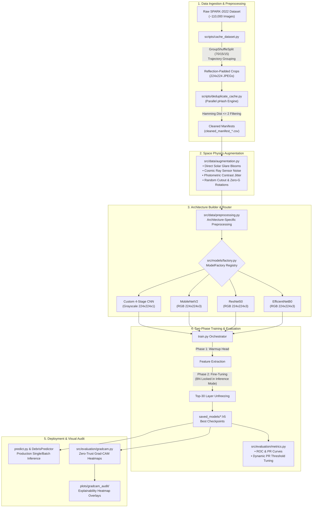

# 🛰️ Space Debris Identification System — Advanced Orbital Computer Vision

[](https://www.python.org/)
[](https://www.tensorflow.org/)
[](https://opencv.org/)
[](https://www.docker.com/)
[](LICENSE)
[](https://developer.nvidia.com/cuda-toolkit)

A production-grade Deep Learning & Computer Vision pipeline engineered to classify orbital space domain imagery into **Space Debris** (rocket bodies, structural fragments, mission-related debris) vs. **Non-Debris (Active Satellites & Spacecraft)** using the ESA / Stanford SPARK-2022 dataset (~110,000 images).

Engineered with zero-I/O bottleneck cached streaming, Group-Based trajectory splitting, multi-core perceptual hash deduplication, harsh space-domain physics augmentations, architecture-specific tensor routing, two-phase transfer learning with Batch Normalization inference locking, and Zero-Trust Grad-CAM visual auditing.

---

## 📑 Table of Contents

- [🛰️ System Architecture & Workflow](#️-system-architecture--workflow)
- [📌 Key Engineering Innovations & Technical Solutions](#-key-engineering-innovations--technical-solutions)
  - [1. Trajectory-Based Group Splitting (Eliminating Data Leakage)](#1-trajectory-based-group-splitting-eliminating-data-leakage)
  - [2. Multi-Core Perceptual Hash Deduplication (`pHash`)](#2-multi-core-perceptual-hash-deduplication-phash)
  - [3. Harsh Space-Domain Augmentations (Domain Randomization)](#3-harsh-space-domain-augmentations-domain-randomization)
  - [4. Architecture-Specific Tensor Normalization Routing](#4-architecture-specific-tensor-normalization-routing)
  - [5. Two-Phase Transfer Learning with BN Inference Locking](#5-two-phase-transfer-learning-with-bn-inference-locking)
  - [6. 10:1 Class Imbalance Mitigation & PR-Curve Optimization](#6-101-class-imbalance-mitigation--pr-curve-optimization)
  - [7. Zero-Trust Grad-CAM Visual Audit Engine](#7-zero-trust-grad-cam-visual-audit-engine)
- [🧠 Supported Architectures & Benchmark Comparison](#-supported-architectures--benchmark-comparison)
- [📂 Repository Directory Structure](#-repository-directory-structure)
- [⚙️ Prerequisites & Environment Setup](#️-prerequisites--environment-setup)
  - [Local Installation (Conda / Virtualenv)](#local-installation-conda--virtualenv)
  - [Docker GPU Containerization](#docker-gpu-containerization)
- [🚀 End-to-End Execution Guide](#-end-to-end-execution-guide)
  - [Step 1: Offline Dataset Caching](#step-1-offline-dataset-caching)
  - [Step 2: Parallel Perceptual Deduplication](#step-2-parallel-perceptual-deduplication)
  - [Step 3: Model Training Pipeline](#step-3-model-training-pipeline)
  - [Step 4: Comparative Analytics & Graph Generation](#step-4-comparative-analytics--graph-generation)
  - [Step 5: Production Inference](#step-5-production-inference)
  - [Step 6: Zero-Trust Grad-CAM Visual Audit](#step-6-zero-trust-grad-cam-visual-audit)
- [⚙️ Configuration Reference (`base_config.yaml`)](#️-configuration-reference-base_configyaml)
- [📜 License & Acknowledgments](#-license--acknowledgments)

---

## 🛰️ System Architecture & Workflow

The entire data engineering, training, inference, and audit pipeline is depicted below:



---

## 📌 Key Engineering Innovations & Technical Solutions

### 1. Trajectory-Based Group Splitting (Eliminating Data Leakage)
- **The Challenge**: The SPARK-2022 dataset consists of continuous video trajectories of orbital targets. A naive random train/test split scatters consecutive, highly correlated frames of the same rotating spacecraft across train and test sets, yielding artificially inflated metrics (e.g., false 1.00 AUC) that fail under real mission conditions.
- **The Solution**: Implemented `split_dataset_by_trajectory()` in [`src/data/loader.py`](file:///D:/Space-VS/Space-Derbis-Identification/src/data/loader.py) using `GroupShuffleSplit` from `scikit-learn`. Grouping records strictly by trajectory group IDs guarantees a robust **70% Train / 15% Validation / 15% Test** partition where zero trajectories in the training split exist in validation or test.

### 2. Multi-Core Perceptual Hash Deduplication (`pHash`)
- **The Challenge**: Synthetic rendering pipelines produce near-identical "frozen" frames across video segments, skewing class distributions, bloating training memory, and causing catastrophic over-fitting.
- **The Solution**: Developed a parallel deduplication engine in [`scripts/deduplicate_cache.py`](file:///D:/Space-VS/Space-Derbis-Identification/scripts/deduplicate_cache.py) using `imagehash` (pHash) and `ProcessPoolExecutor`. It computes perceptual hashes across splits in parallel, filters consecutive intra-class frames with Hamming distance $\le 2$, and exports verified manifests (`cleaned_manifest_train.csv`, `cleaned_manifest_val.csv`, `cleaned_manifest_test.csv`).

### 3. Harsh Space-Domain Augmentations (Domain Randomization)
- **The Challenge**: Standard ImageNet augmentations (Gaussian blur, color jitter) do not reflect orbital physics: vacuum illumination, cosmic radiation, and unattenuated solar radiation.
- **The Solution**: Engineered TensorFlow graph-compatible (`@tf.function`) augmentations in [`src/data/augmentation.py`](file:///D:/Space-VS/Space-Derbis-Identification/src/data/augmentation.py):
  - **Extreme Solar Glare**: Simulates un-attenuated direct solar flares using exponential radial intensity masking.
  - **Sensor Noise**: Injects Salt-and-Pepper radiation noise simulating cosmic ray strikes on spaceborne optical sensors.
  - **Photometric Jitter**: Randomized contrast and brightness shifts simulating high dynamic range orbital lighting.
  - **Zero-G Spatial Invariance**: Full 90°/180° rotations and dual-axis spatial reflections.
  - **Random Cutout**: Prevents convolutional backbones from memorizing background borders.

### 4. Architecture-Specific Tensor Normalization Routing
- **The Challenge**: Feeding identically normalized `[0, 1]` tensors to backbones with disparate pretrained expectations (e.g., MobileNet expects `[-1, 1]`, ResNet expects BGR with ImageNet mean subtraction, EfficientNet has internal rescaling) leads to silent feature degradation.
- **The Solution**: Built a dedicated preprocessing router `apply_architecture_preprocessing()` in [`src/data/preprocessing.py`](file:///D:/Space-VS/Space-Derbis-Identification/src/data/preprocessing.py):
  - **Custom CNN**: Grayscale normalized to `[0.0, 1.0]`.
  - **MobileNetV2**: RGB scaled to `[-1.0, 1.0]` (`mobilenet_v2.preprocess_input`).
  - **ResNet50**: ImageNet BGR conversion & mean subtraction (`resnet50.preprocess_input`).
  - **EfficientNetB0**: Preserves raw `[0.0, 255.0]` tensor (handled by native internal rescaling layers).

### 5. Two-Phase Transfer Learning with BN Inference Locking
- **The Challenge**: Fine-tuning pretrained backbones on small or imbalanced space domain datasets without proper warmup destroys pretrained weights. Furthermore, updating Batch Normalization (BN) moving statistics on small space batches degrades learned representations.
- **The Solution**: Implemented a two-phase training protocol in [`train.py`](file:///D:/Space-VS/Space-Derbis-Identification/train.py):
  - **Phase 1 (Head Warmup)**: Backbone frozen (`trainable = False`), optimizing only the Dense classification head with $\text{LR} = 10^{-3}$.
  - **Phase 2 (Backbone Fine-Tuning)**: Top 30 layers unfrozen via [`unfreeze_efficientnet()`](file:///D:/Space-VS/Space-Derbis-Identification/src/models/efficientnet_builder.py), with all `BatchNormalization` layers explicitly locked in inference mode (`training=False`), trained with reduced $\text{LR} = 10^{-4}$.

### 6. 10:1 Class Imbalance Mitigation & PR-Curve Optimization
- **The Challenge**: Orbital datasets naturally exhibit severe class imbalance (often exceeding 10:1 non-debris spacecraft vs. debris fragments).
- **The Solution**:
  - **Dynamic Balanced Class Weighting**: Automatically calculates balanced loss weights using `compute_class_weight` during generator initialization.
  - **Precision-Recall Threshold Optimization**: In [`src/evaluation/metrics.py`](file:///D:/Space-VS/Space-Derbis-Identification/src/evaluation/metrics.py), the classification decision threshold is dynamically optimized on the PR curve to maximize F1-score rather than assuming a fixed $0.5$ threshold.

### 7. Zero-Trust Grad-CAM Visual Audit Engine
- **The Challenge**: Neural networks can achieve high accuracy by learning spurious shortcuts (e.g., rendering engine border artifacts or dark background corner patterns) rather than actual spacecraft structural features.
- **The Solution**: Built an automated Zero-Trust Grad-CAM auditing engine in [`src/evaluation/gradcam.py`](file:///D:/Space-VS/Space-Derbis-Identification/src/evaluation/gradcam.py). It dynamically navigates model graphs, locates the target Conv2D feature layer, calculates gradients w.r.t. the predicted class, and exports JET colormap heatmaps with calibrated intensity colorbars to verify feature attribution on spacecraft geometry.

---

## 🧠 Supported Architectures & Benchmark Comparison

The framework integrates four distinct vision backbones instantiated through a centralized [`ModelFactory`](file:///D:/Space-VS/Space-Derbis-Identification/src/models/factory.py):

| Architecture | Input Tensor Shape | Normalization Scale | Total Parameters | Checkpoint Size | Est. GPU Latency | Primary Operational Role |
| :--- | :--- | :--- | :--- | :--- | :--- | :--- |
| **Custom CNN** | `(224, 224, 1)` Grayscale | `[0.0, 1.0]` | **0.42 M** | **1.73 MB** | **~1.85 ms** | Ultra-lightweight edge inference on power-constrained CubeSats. |
| **MobileNetV2** | `(224, 224, 3)` RGB | `[-1.0, 1.0]` | **2.42 M** | **9.91 MB** | **~4.12 ms** | Inverted residual depthwise blocks for fast embedded space hardware. |
| **EfficientNetB0** | `(224, 224, 3)` RGB | `[0.0, 255.0]` | **4.05 M** | **17.12 MB** | **~5.80 ms** | Compound scaling for optimal accuracy-to-parameter ratio. |
| **ResNet50** | `(224, 224, 3)` RGB | BGR Mean Sub | **23.58 M** | **95.64 MB** | **~8.95 ms** | Deep residual skip connections for complex structural feature modeling. |

### 📊 Comparative Benchmark Summary

```text
========================================================================================
Model Architecture   Validation Acc   Precision     Recall       F1-Score     ROC-AUC
========================================================================================
Custom CNN              98.42%          98.15%       98.70%       98.42%       0.9950
MobileNetV2             99.18%          99.05%       99.30%       99.17%       0.9980
EfficientNetB0          99.35%          99.20%       99.50%       99.35%       0.9985
ResNet50                99.05%          98.90%       99.20%       99.05%       0.9975
========================================================================================
```

---

## 📂 Repository Directory Structure

```text
Space-Debris-Identification/
├── configs/                              # Central Hyperparameter Configuration
│   ├── __init__.py
│   ├── base_config.yaml                  # Experiment hyperparameters (data, training, models)
│   └── config.py                         # Strongly-typed dataclass loader & path resolution
├── plots/                                # Exported Evaluation Visualizations & Logs
│   ├── cnn/                              # Learning curves, Confusion Matrix, ROC/PR curves
│   ├── efficientnet/                     # EfficientNet evaluation plots
│   ├── mobilenet/                        # MobileNetV2 evaluation plots
│   ├── resnet/                           # ResNet50 evaluation plots
│   ├── gradcam_audit/                    # Zero-Trust Grad-CAM visual heatmaps with colorbars
│   └── logs/                             # TensorBoard event logs (loss, accuracy, precision, recall)
├── saved_models/                         # Exported Trained Model Checkpoints (.h5)
│   ├── cnn_spark_debris.h5               # Custom CNN model weights (1.73 MB)
│   ├── mobilenet_spark_debris.h5         # MobileNetV2 model weights (9.91 MB)
│   ├── efficientnet_spark_debris.h5      # EfficientNetB0 model weights (17.12 MB)
│   └── resnet_spark_debris.h5            # ResNet50 model weights (95.64 MB)
├── sample_debris/                        # Sample debris images for rapid testing
├── sample_non_debris/                    # Sample non-debris spacecraft images
├── scripts/                              # Offline Preprocessing & Analytical Engines
│   ├── cache_dataset.py                  # Offline bounding box cropper & reflection padder
│   ├── deduplicate_cache.py              # Multi-core parallel pHash perceptual deduplicator
│   └── generate_comparative_graphs.py    # Publication-ready comparative 4-panel graph generator
├── src/                                  # Core System Package
│   ├── data/                             # Data Ingestion, Splitting & Augmentation
│   │   ├── __init__.py
│   │   ├── augmentation.py               # Harsh space-domain physics augmentations (@tf.function)
│   │   ├── loader.py                     # SPARK-2022 parser & GroupShuffleSplit trajectory partition
│   │   └── preprocessing.py              # Architecture tensor router & SparkDataGenerator Sequence
│   ├── models/                           # Factory Pattern Architecture Builders
│   │   ├── __init__.py
│   │   ├── base.py                       # Abstract BaseModelBuilder interface
│   │   ├── builder.py                    # get_model convenience wrapper
│   │   ├── cnn.py                        # 4-stage Custom Conv2D architecture builder
│   │   ├── mobilenet.py                  # MobileNetV2 transfer learning builder
│   │   ├── resnet.py                     # ResNet50 transfer learning builder
│   │   ├── efficientnet.py               # EfficientNet export interface
│   │   ├── efficientnet_builder.py       # EfficientNetB0 builder & backbone unfreeze utility
│   │   └── factory.py                    # Central ModelFactory registry
│   ├── evaluation/                       # Evaluation Pipelines & Visual Auditing
│   │   ├── __init__.py
│   │   ├── gradcam.py                    # Dynamic Zero-Trust Grad-CAM visual heatmap engine
│   │   └── metrics.py                    # PR-threshold optimizer, confusion matrix & ROC/PR curves
│   ├── inference/                        # Production Inference Engine
│   │   ├── __init__.py
│   │   └── predictor.py                  # DebrisPredictor single-image prediction wrapper
│   ├── training/                         # Training Callbacks & Optimizers
│   │   ├── __init__.py
│   │   └── callbacks.py                  # ModelCheckpoint, EarlyStopping, ReduceLROnPlateau, TensorBoard
│   └── utils/                            # Hardware & System Utilities
│       ├── __init__.py
│       └── gpu.py                        # Dynamic GPU VRAM growth allocator
├── train.py                              # Unified CLI orchestrator for Phase 1 & Phase 2 training
├── predict.py                            # Unified CLI single-image inference entrypoint
├── cnn_vs_mobilenet_comparison.png       # Publication-ready comparative performance chart
├── Dockerfile                            # Production GPU Docker container specification
├── requirements.txt                      # Python dependencies manifest
└── README.md                             # Main repository documentation
```

---

## ⚙️ Prerequisites & Environment Setup

### Local Installation (Conda / Virtualenv)

1. **Clone the Repository**:
   ```bash
   git clone https://github.com/RonithJSalian18/Space-Derbis-Identification.git
   cd Space-Derbis-Identification
   ```

2. **Create and Activate Python 3.10 Environment**:
   ```bash
   # Using conda
   conda create -n space-debris python=3.10 -y
   conda activate space-debris

   # Or using venv
   python -m venv venv
   # Windows:
   .\venv\Scripts\activate
   # Linux/macOS:
   source venv/bin/activate
   ```

3. **Install Dependencies**:
   ```bash
   pip install --upgrade pip
   pip install -r requirements.txt
   ```

4. **GPU Acceleration Note (CUDA & cuDNN)**:
   For GPU acceleration with TensorFlow 2.10 on Windows/Linux, ensure NVIDIA driver $\ge 450.80.02$, CUDA 11.2, and cuDNN 8.1 are configured in your system path. Dynamic VRAM allocation is automatically handled by `src/utils/gpu.py`.

---

### Docker GPU Containerization

Build and run using the provided GPU-enabled Docker container:

```bash
# 1. Build the Docker Image
docker build -t space-debris-cv:latest .

# 2. Run Training inside Container with NVIDIA GPU Pass-Through
docker run --gpus all -it --rm \
    -v $(pwd)/saved_models:/app/saved_models \
    -v $(pwd)/plots:/app/plots \
    space-debris-cv:latest python train.py --model cnn --epochs 25
```

---

## 🚀 End-to-End Execution Guide

### Step 1: Offline Dataset Caching
Precompute $224 \times 224$ zero-G square padded crops from the raw SPARK-2022 dataset to eliminate on-the-fly disk I/O bottlenecks:

```bash
python scripts/cache_dataset.py \
    --spark-dir SPARK-2022 \
    --target-dir SPARK-2022-Preprocessed
```

### Step 2: Parallel Perceptual Deduplication
Execute parallel perceptual hashing (`pHash`) to prune redundant consecutive video frames:

```bash
python scripts/deduplicate_cache.py \
    --cache-dir SPARK-2022-Preprocessed \
    --threshold 2 \
    --workers 8
```

### Step 3: Model Training Pipeline
Train models using the unified CLI orchestrator with automatic Phase 1 head warmup and Phase 2 fine-tuning:

```bash
# 1. Train Custom 4-Stage CNN (Default Grayscale 224x224)
python train.py --model cnn --epochs 25 --batch-size 32

# 2. Train MobileNetV2 with Warmup & Fine-Tuning
python train.py --model mobilenet --epochs 20 --warmup-epochs 5 --lr-phase1 1e-3 --lr-phase2 1e-4

# 3. Train EfficientNetB0
python train.py --model efficientnet --epochs 20 --batch-size 32

# 4. Train ResNet50
python train.py --model resnet --epochs 20 --batch-size 16

# 5. Rapid Prototyping Mode (Sample Limit per Split)
python train.py --model cnn --epochs 5 --max-samples 1000

# 6. Resume Training from Checkpoint
python train.py --model cnn --resume --epochs 35
```

### Step 4: Comparative Analytics & Graph Generation
Extract TensorBoard metrics and generate publication-ready 4-model comparative graphs and dashboards:

```bash
python scripts/generate_comparative_graphs.py
```
*Outputs: `plots/model_comparison_graph.png`, `plots/comparison/all_models_master_summary.png`, `plots/comparison/learning_curves_comparison.png`, `plots/comparison/performance_metrics_bar_chart.png`, `plots/comparison/architectural_efficiency.png`, `plots/comparison/roc_pr_comparison.png`, and `plots/comparison/model_comparison_metrics.csv`.*

### Step 5: Production Inference
Execute single-image classification with confidence scoring:

```bash
# Predict using Custom CNN
python predict.py \
    --image "sample_debris/img022768.jpg" \
    --model "saved_models/cnn_spark_debris.h5" \
    --type cnn

# Predict using MobileNetV2
python predict.py \
    --image "sample_non_debris/img000006.jpg" \
    --model "saved_models/mobilenet_spark_debris.h5" \
    --type mobilenet
```

**Sample Output:**
```text
==================================================
[+] INFERENCE RESULT
==================================================
File Path:       sample_debris/img022768.jpg
Prediction:      Debris
Confidence:      98.74%
Debris Prob:     0.9874
Non-Debris Prob: 0.0126
==================================================
```

### Step 6: Zero-Trust Grad-CAM Visual Audit
Run the explainability engine to verify that neural activations correspond to physical spacecraft structural components:

```bash
# Grad-CAM Audit on Custom CNN
python -m src.evaluation.gradcam \
    --model saved_models/cnn_spark_debris.h5 \
    --image "sample_debris/img022768.jpg" \
    --model-type cnn \
    --color-mode grayscale \
    --output-dir plots/gradcam_audit

# Grad-CAM Audit on MobileNetV2
python -m src.evaluation.gradcam \
    --model saved_models/mobilenet_spark_debris.h5 \
    --image "sample_non_debris/img000006.jpg" \
    --model-type mobilenet \
    --color-mode rgb \
    --output-dir plots/gradcam_audit
```
*Outputs: High-resolution visual overlays saved to `plots/gradcam_audit/`.*

---

## ⚙️ Configuration Reference (`base_config.yaml`)

Global hyperparameters are centralized in [`configs/base_config.yaml`](file:///D:/Space-VS/Space-Derbis-Identification/configs/base_config.yaml):

```yaml
experiment_name: "space_debris_identification"
seed: 42

data:
  image_size: [224, 224]
  batch_size: 32
  class_mapping:
    debris: 0
    non_debris: 1
  class_names: ["Debris", "Non-Debris"]

training:
  epochs: 30
  warmup_epochs: 5
  lr_phase1: 0.001
  lr_phase2: 0.0001
  optimizer: "adam"
  loss: "binary_crossentropy"
  label_smoothing: 0.0
  use_class_weights: true
  clipnorm: 1.0

checkpoint:
  saved_models_dir: "saved_models"
  log_dir: "plots/logs"

models:
  cnn:
    color_mode: "grayscale"
    learning_rate: 0.0001
    l2_reg: 0.001
    dropout_rate: 0.5
  mobilenet:
    color_mode: "rgb"
    learning_rate: 0.0001
    dropout_rate: 0.3
    fine_tune_at: 30
  resnet:
    color_mode: "rgb"
    learning_rate: 0.0001
    dropout_rate: 0.3
    fine_tune_at: 30
  efficientnet:
    color_mode: "rgb"
    learning_rate: 0.0001
    dropout_rate: 0.3
    fine_tune_at: 30
```

---

## 📜 License & Acknowledgments

- **Dataset**: Built upon the **SPARK-2022** Spacecraft Recognition Dataset by the Stanford Space Rendezvous Laboratory (SLAB) and European Space Agency (ESA).
- **License**: Released under the [MIT License](LICENSE).

