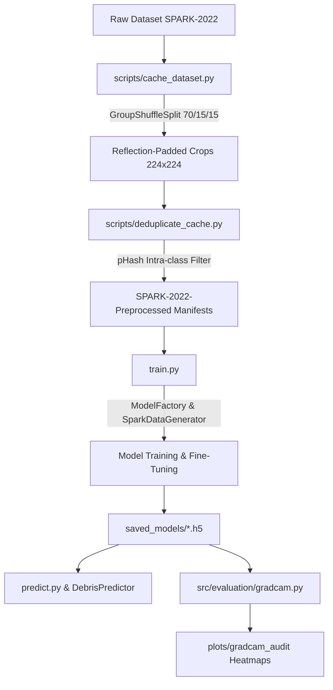

# 🛰️ Space Debris Identification System — Project Architecture & File Documentation

Welcome to the comprehensive technical documentation for the **Space Debris Identification System**. This document provides an exhaustive breakdown of the project's directory structure, every individual file, and all contained functions, classes, and operational mechanics.

---

## 📁 System Directory Hierarchy

```text
Space-Debris-Identification/
├── configs/                          # Hyperparameters & Central Config Parser
│   ├── base_config.yaml              # Centralized YAML hyperparameter settings
│   └── config.py                     # Python dataclass loader & path resolution
├── scripts/                          # Preprocessing & Analytical Graph Engines
│   ├── cache_dataset.py              # Offline dataset image cropper & reflection padder
│   ├── deduplicate_cache.py          # Parallel Perceptual Hashing (pHash) deduplicator
│   └── generate_comparative_graphs.py# Multi-panel benchmarking & comparative plotting
├── src/                              # Core Source Package
│   ├── data/                         # Data Ingestion, Grouping & Augmentation
│   │   ├── augmentation.py           # Graph-compatible TensorFlow harsh space augmentations
│   │   ├── loader.py                 # SPARK-2022 dataset parser & GroupShuffleSplit
│   │   └── preprocessing.py          # Architecture tensor router & SparkDataGenerator
│   ├── models/                       # Factory Pattern Neural Architecture Builders
│   │   ├── base.py                   # Abstract base builder interface (BaseModelBuilder)
│   │   ├── builder.py                # Wrapper factory function (get_model)
│   │   ├── cnn.py                    # Custom 4-stage Conv2D architecture builder
│   │   ├── mobilenet.py              # MobileNetV2 transfer learning builder
│   │   ├── resnet.py                 # ResNet50 transfer learning builder
│   │   ├── efficientnet_builder.py   # EfficientNetB0 builder & backbone unfreezer
│   │   └── factory.py                # Central ModelFactory registry
│   ├── evaluation/                   # Metrics Calculation & Visual Audit
│   │   ├── gradcam.py                # Zero-Trust Grad-CAM visual heatmap auditor
│   │   └── metrics.py                # PR-threshold optimizer & metric plotter
│   ├── inference/                    # Production Inference Engine
│   │   └── predictor.py              # DebrisPredictor single-image classification wrapper
│   ├── training/                     # Training Callbacks & Schedulers
│   │   └── callbacks.py              # ModelCheckpoint, EarlyStopping, ReduceLROnPlateau
│   └── utils/                        # System & Hardware Helpers
│       └── gpu.py                    # Dynamic GPU VRAM growth allocator
├── saved_models/                     # Export directory for trained weights (.h5)
├── plots/                            # Output directory for evaluation plots & heatmaps
├── sample_debris/                    # Sample debris images for rapid testing
├── sample_non_debris/                # Sample non-debris spacecraft images
├── train.py                          # Command-line training pipeline entrypoint
├── predict.py                        # Unified command-line inference script
├── plot_comparison.py                # Standalone bar chart generator (Custom CNN vs MobileNetV2)
├── Dockerfile                        # GPU-enabled container configuration
├── requirements.txt                  # Python dependencies
└── README.md                         # Main repository documentation
```

---

## ⚡ Root CLI Scripts & Infrastructure Files

### 1. `train.py`
Command-line orchestrator for Phase 1 (classification head warmup) and Phase 2 (fine-tuning) training pipelines. Loads cached dataset manifests, configures learning rates, handles class weighting, and evaluates performance on test splits.

- **`parse_args()`**: Parses command-line arguments including `--model`, `--epochs`, `--warmup-epochs`, `--batch-size`, `--lr-phase1`, `--lr-phase2`, `--max-samples`, and `--resume`.
- **`load_dataset_records(split, cache_dir, spark_dir)`**: Ingests dataset records from preprocessed CSV manifests (`cleaned_manifest_train.csv`). Falls back to raw `SPARK-2022` if cache is absent.
- **`main()`**: Main execution sequence:
  1. Initializes seeds and GPU memory via `setup_gpu()`.
  2. Ingests Train, Val, and Test split records.
  3. Computes class weights via `compute_class_weight` to handle imbalance.
  4. Builds and compiles model architecture via `ModelFactory`.
  5. Trains model using `SparkDataGenerator` and Keras callbacks.
  6. Executes `evaluate_and_plot()` on the test split.

---

### 2. `predict.py`
Unified single-image inference script for executing predictions on target imagery using trained `.h5` model files.

- **`main()`**: Parses `--image`, `--model`, and `--type` command line arguments, initializes `DebrisPredictor`, executes prediction, and prints formatted class probabilities and confidence scores.

---

### 3. `plot_comparison.py`
Standalone script to generate a high-resolution, publication-ready grouped bar chart comparing precision, recall, and F1-score between Custom CNN and MobileNetV2.

- **`generate_comparison_chart()`**: Constructs a styled Matplotlib figure, plots metric bars, annotates percentage values above each bar, and saves `cnn_vs_mobilenet_comparison.png`.

---

### 4. `Dockerfile`
Configures a Docker image based on `tensorflow/tensorflow:2.10.0-gpu` for containerized GPU training and evaluation. Sets up working directory, installs OpenCV system libraries (`libgl1-mesa-glx`, `libglib2.0-0`), and installs `requirements.txt`.

---

### 5. `requirements.txt`
Defines project dependencies including `tensorflow`, `opencv-python`, `pandas`, `numpy`, `scikit-learn`, `matplotlib`, `seaborn`, `pillow`, `imagehash`, and `tqdm`.

---

## ⚙️ Configuration Module (`configs/`)

### `configs/base_config.yaml`
Centralized YAML configuration file specifying global experiment parameters:
- **`data`**: Image size `[224, 224]`, batch size `32`, class mappings (`debris: 0`, `non_debris: 1`).
- **`training`**: Epoch counts, learning rates (`lr_phase1: 0.001`, `lr_phase2: 0.0001`), loss function, and label smoothing.
- **`models`**: Architecture-specific hyperparameter dicts for `cnn`, `mobilenet`, `resnet`, and `efficientnet`.

---

### `configs/config.py`
Python interface for loading and parsing system configuration values.

- **Global Variables**: `BASE_DIR`, `SAVED_MODELS_DIR`, `CLASS_MAPPING`, `IMAGE_SIZE`, `BATCH_SIZE`, `EPOCHS`, `SEED`.
- **`AppConfig` (dataclass)**: Strongly-typed dataclass containing `experiment_name`, `seed`, `data`, `training`, `checkpoint`, and `models`.
  - **`load_from_yaml(yaml_path)`**: Reads `base_config.yaml`, converts image size to tuple, and returns an initialized `AppConfig` object.

---

## 🛠️ Offline Processing Engines (`scripts/`)

### 1. `scripts/cache_dataset.py`
Offline dataset generator that crops bounding boxes, applies reflection padding, resizes imagery to 224x224, and exports cached CSV manifests.

- **`cache_records_subset(records, split_name, target_dir)`**: Processes image records for a given split (`train`, `val`, or `test`), extracts images from raw directories or ZIP archives, applies `crop_bbox_and_pad_square()`, writes JPEG files to `SPARK-2022-Preprocessed/<split>/`, and saves `cached_<split>.csv`.
- **`main()`**: Loads raw records via `get_cleaned_dataset()`, performs trajectory splitting via `split_dataset_by_trajectory()`, and caches each split.

---

### 2. `scripts/deduplicate_cache.py`
Parallel deduplication engine that uses Perceptual Hashing (`pHash`) to remove near-duplicate consecutive frame images.

- **`compute_phash_single(args_tuple)`**: Worker function executed in parallel processes to calculate the perceptual hash (`imagehash.phash`) for a single image file.
- **`process_deduplication(manifest_csv, cache_dir, threshold, max_workers, output_csv)`**: Computes pHashes in parallel using `ProcessPoolExecutor`, performs intra-class deduplication by removing images with Hamming distance $\le \text{threshold}$, and saves `cleaned_manifest.csv`.
- **`deduplicate_all_splits(cache_dir, threshold, max_workers)`**: Runs deduplication sequentially across `train`, `val`, and `test` manifests.
- **`main()`**: Command line parser and entrypoint.

---

### 3. `scripts/generate_comparative_graphs.py`
Comprehensive analytical engine for extracting TensorBoard training/validation logs and generating comparative 4-model benchmarking audits across **Custom CNN**, **MobileNetV2**, **ResNet-50**, and **EfficientNet-B0**.

- **`extract_tensorboard_metrics(log_dir)`**: Reads step-wise loss, accuracy, precision, and recall metrics from TensorBoard `tfevents` files using `EventAccumulator`.
- **`generate_master_comparison_graph(all_metrics, save_path)`**: Generates the primary 2x2 multi-panel dashboard comparing validation accuracy trajectories, peak benchmark metrics, loss convergence, and resource footprint across all 4 models (`plots/model_comparison_graph.png`).
- **`generate_learning_curves_4models(all_metrics, save_path)`**: Plots 4 panels comparing loss, accuracy, precision, and recall learning dynamics (train vs. val) for all four architectures.
- **`generate_metrics_bar_chart(all_metrics, save_path)`**: Plots peak validation score comparison bars (Accuracy, Precision, Recall, F1).
- **`generate_architectural_efficiency_chart(save_path)`**: Visualizes parameter counts, checkpoint storage footprints (MB), and live GPU inference latencies (ms/image).
- **`generate_roc_pr_comparison(save_path)`**: Computes and overlays ROC Curves and Precision-Recall Curves across all 4 models on balanced test evaluation data.
- **`generate_executive_composite_summary(all_metrics, save_path)`**: Produces an executive 6-panel audit dashboard combining accuracy, loss, F1, latency, parameter trade-offs, and tabular summary.
- **`export_metrics_summary(all_metrics, json_path, csv_path)`**: Exports clean machine-readable benchmarking data (`model_comparison_metrics.csv` & `.json`).

---

## 📦 Core Package (`src/`)

### 🛠️ Data Subpackage (`src/data/`)

#### 1. `src/data/augmentation.py`
Provides TensorFlow graph-compatible (`@tf.function`) data augmentation operations tailored to orbital space conditions:

- **`add_solar_glare(image, glare_prob, max_intensity)`**: Simulates un-attenuated direct sun glare blooms using exponential radial distance masking.
- **`add_sensor_noise(image, noise_prob, salt_pepper_ratio)`**: Injects randomized Salt-and-Pepper noise simulating cosmic ray strikes on sensor hardware.
- **`apply_photometric_jitter(image, jitter_prob)`**: Applies randomized brightness and contrast adjustments.
- **`add_random_cutout(image, cutout_prob, mask_size_fraction)`**: Erases rectangular image patches to prevent shortcut learning of outer frame borders.
- **`apply_space_domain_augmentations(image)`**: Combines photometric jitter, solar glare, sensor noise, cutout, spatial flips, and 90° rotations.
- **`get_data_augmentation_pipeline(image_size)`**: Wraps space-domain augmentations in a `tf.keras.Sequential` layer.

---

#### 2. `src/data/loader.py`
Handles raw SPARK-2022 dataset archive ingestion, metadata parsing, and group-based trajectory splitting.

- **`extract_trajectory_id(record)`**: Parses object sequence and trajectory identifiers from metadata or image filenames (e.g., `cheops_0012` $\rightarrow$ trajectory group ID).
- **`split_dataset_by_trajectory(records, train_ratio, val_ratio, test_ratio, random_state)`**: Uses `GroupShuffleSplit` from `scikit-learn` to partition data into **70% Train / 15% Val / 15% Test** splits such that no trajectory in Train appears in Val or Test.
- **`load_cached_records(split, cache_dir)`**: Loads preprocessed image paths and labels from `cleaned_manifest_<split>.csv`.
- **`extract_spark_dataset(spark_dir)`**: Verifies and extracts `train.zip`, `val.zip`, and `test.zip` archives if necessary.
- **`parse_spark_csv(csv_path, img_dir, split_name, spark_dir)`**: Reads raw SPARK CSV annotations using pandas, extracts bounding boxes `[xmin, ymin, xmax, ymax]`, and maps 11 object classes into binary labels (Debris = 0, Non-Debris = 1).
- **`load_spark_split(split, spark_dir)`**: High-level loader for a single raw split.
- **`get_cleaned_dataset(spark_dir, split, remove_duplicates)`**: Main entrypoint for ingesting raw dataset records across splits.

---

#### 3. `src/data/preprocessing.py`
Provides architecture-specific tensor normalization and custom high-speed data generators.

- **`apply_architecture_preprocessing(img, model_type)`**: Directs input image arrays through model-specific normalization scale:
  - **ResNet50**: ImageNet BGR conversion & mean subtraction (`resnet.preprocess_input`).
  - **MobileNetV2**: Pixel scaling to `[-1.0, 1.0]` (`mobilenet_v2.preprocess_input`).
  - **EfficientNetB0**: Preserves raw `[0.0, 255.0]` tensor (native internal scaling).
  - **Custom CNN**: Pixel scaling to `[0.0, 1.0]`.
- **`center_crop_and_resize(img, target_size)`**: Pads image to a square using reflection padding (`cv2.BORDER_REFLECT_101`) and resizes to target shape.
- **`crop_bbox_and_pad_square(img, bbox, target_size)`**: Bounding box cropping pipeline that crops raw images, applies reflection padding to eliminate black border artifacts, and resizes to 224x224.
- **`preprocess_image(path, bbox, zip_path, zip_filename, target_size, color_mode, model_type)`**: Loads and normalizes a single image.
- **`SparkDataGenerator` (class)**: Production Keras `Sequence` generator that streams preprocessed batches directly to GPU VRAM with zero I/O bottleneck.
  - **`__len__()`**: Returns total batch count per epoch.
  - **`__getitem__(index)`**: Loads, crops, converts color spaces, applies `apply_architecture_preprocessing()`, and returns `(X_batch, y_batch)`.
  - **`on_epoch_end()`**: Shuffles dataset indices and invokes garbage collection.
- **`load_dataset_in_memory(records, target_size, color_mode, model_type)`**: Loads dataset records directly into RAM arrays.
- **`get_data_generators(color_mode)`**: Returns `ImageDataGenerator` instances configured with reflection fill mode (`fill_mode='reflect'`).

---

### 🧠 Models Subpackage (`src/models/`)

#### 1. `src/models/base.py`
- **`BaseModelBuilder` (abstract class)**: Standard interface for neural network builders. Requires derived classes to implement `.build() -> tf.keras.Model`.

---

#### 2. `src/models/cnn.py`
- **`CustomCNNBuilder` (class)**: Builds a 4-stage deep convolutional architecture:
  - 4 Conv2D blocks (32, 64, 128, 256 filters) with ReLU activations, L2 regularization, Batch Normalization, and Max Pooling.
  - Global Average Pooling (GAP), Dense(128), 50% Dropout, and Sigmoid classification head.
- **`build_custom_cnn(input_shape, l2_reg, dropout_rate)`**: Legacy builder helper function.

---

#### 3. `src/models/mobilenet.py`
- **`MobileNetBuilder` (class)**: Constructs MobileNetV2 transfer learning model:
  - Freezes base backbone during construction (`base_model.trainable = False`).
  - Calls `base_model(x, training=False)` to lock Batch Normalization layers in inference mode.
  - Classification head: GAP $\rightarrow$ BatchNorm $\rightarrow$ Dropout $\rightarrow$ Dense(128, ReLU, He-Normal, L2) $\rightarrow$ BatchNorm $\rightarrow$ Dropout $\rightarrow$ Dense(1, Sigmoid, Prior-Bias=2.3).
- **`unfreeze_mobilenet(model, fine_tune_blocks)`**: Stage-aware fine-tuning utility unfreezing top inverted residual blocks while locking Batch Normalization.
- **`build_mobilenet(input_shape, dropout_rate)`**: Helper builder function.

---

#### 4. `src/models/resnet.py`
- **`ResNetBuilder` (class)**: Constructs stabilized ResNet50 transfer learning model:
  - Freezes backbone during construction (`base_model.trainable = False`).
  - Uses clean single-stage `resnet.preprocess_input` (no double rescaling).
  - Classification head: GAP $\rightarrow$ BatchNorm $\rightarrow$ Dropout $\rightarrow$ Dense(128, ReLU, He-Normal, L2) $\rightarrow$ BatchNorm $\rightarrow$ Dropout $\rightarrow$ Dense(1, Sigmoid, Prior-Bias=2.3).
- **`unfreeze_resnet(model, fine_tune_stage)`**: Unfreezes complete residual stages (e.g. stage 5: `conv5`) while keeping Batch Normalization locked in inference mode.
- **`build_resnet(input_shape, dropout_rate)`**: Helper builder function.

---

#### 5. `src/models/efficientnet_builder.py`
- **`EfficientNetBuilder` (class)**: Constructs stabilized EfficientNetB0 transfer learning model:
  - Freezes backbone during initial build to prevent mode collapse.
  - Uses native EfficientNet internal scaling (clean [0, 255] RGB float32 inputs).
  - Classification head: GAP $\rightarrow$ BatchNorm $\rightarrow$ Dropout $\rightarrow$ Dense(128, ReLU, He-Normal, L2) $\rightarrow$ BatchNorm $\rightarrow$ Dropout $\rightarrow$ Dense(1, Sigmoid, Prior-Bias=2.3).
- **`unfreeze_efficientnet(model, fine_tune_blocks)`**: Stage-aware fine-tuning utility unfreezing top MBConv blocks while maintaining all Batch Normalization layers locked in frozen mode.
- **`build_efficientnet(input_shape, dropout_rate)`**: Helper builder function.


---

#### 6. `src/models/factory.py`
- **`ModelFactory` (class)**: Factory Pattern registry for creating and compiling neural network architectures.
  - **`register(name, builder_cls)`**: Registers new architecture builders dynamically.
  - **`create_model(architecture_name, learning_rate, image_size, label_smoothing, config)`**: Builds model instance, sets Adam optimizer (`clipnorm=1.0`), applies Binary Crossentropy loss, compiles metrics (Accuracy, Precision, Recall), and returns `(compiled_model, color_mode)`.

---

#### 7. `src/models/builder.py`
- **`get_model(architecture_name, learning_rate)`**: Convenience wrapper delegating directly to `ModelFactory.create_model()`.

---

### 📊 Evaluation & Audit Subpackage (`src/evaluation/`)

#### 1. `src/evaluation/gradcam.py`
Zero-Trust Grad-CAM visual auditing engine for explaining model predictions.

- **`find_last_conv_layer(model)`**: Recursively searches model layers to locate the final Conv2D layer in standalone or nested backbone architectures.
- **`make_gradcam_heatmap(img_array, model, backbone_layer_name, last_conv_layer_name, pred_index)`**: Computes gradients of the predicted class score with respect to feature maps of the final Conv2D layer via `tf.GradientTape`, applies guided pooling, and outputs a normalized 2D heatmap matrix `[0, 1]`.
- **`run_zero_trust_audit(model_path, image_path, output_dir, color_mode, model_type)`**: Loads target model and image, generates Grad-CAM heatmap, overlays heatmap on original image using OpenCV JET colormap, and saves visual audit plot with colorbar.

---

#### 2. `src/evaluation/metrics.py`
Comprehensive evaluation pipeline and visualization plotter.

- **`plot_learning_curves(history, save_dir, show_plot)`**: Plots 4-panel grid of Loss, Accuracy, Precision, and Recall curves over training epochs and saves `learning_curves.png`.
- **`evaluate_and_plot(model, X_test, y_test, class_names, save_dir, show_plot)`**: Evaluates test set predictions, optimizes decision threshold on Precision-Recall curves to mitigate class imbalance, prints classification reports, and exports:
  - `confusion_matrix.png`
  - `roc_curve.png` (with AUC calculation)
  - `precision_recall_curve.png` (with PR-AUC calculation)

---

### 🔮 Inference Subpackage (`src/inference/`)

#### `src/inference/predictor.py`
- **`DebrisPredictor` (class)**: Production inference handler for single-image classification.
  - **`__init__(model_path, model_type)`**: Instantiates target architecture via `ModelFactory`, unfreezes transfer learning backbones if required, and loads model weights from `.h5` files.
  - **`predict(image_path, threshold)`**: Preprocesses target image, runs forward inference, applies decision thresholding, and returns detailed dictionary:
    ```python
    {
        "image_path": "path/to/image.jpg",
        "prediction": "Debris" | "Non-Debris",
        "confidence": 98.45,
        "prob_debris": 0.9845,
        "prob_non_debris": 0.0155
    }
    ```

---

### 🏋️ Training Subpackage (`src/training/`)

#### `src/training/callbacks.py`
- **`get_callbacks(save_path, log_dir, patience_early_stopping, patience_reduce_lr)`**: Configures training callbacks:
  - **`EarlyStopping`**: Monitors `val_loss`, stops training if unaligned for 7 epochs, and restores best weights.
  - **`ReduceLROnPlateau`**: Halves learning rate if `val_loss` plateaus for 3 epochs (down to `1e-6`).
  - **`ModelCheckpoint`**: Saves top model weights (`save_weights_only=True`) on `val_loss` improvement.
  - **`TensorBoard`**: Streams training logs to `plots/logs/`.

---

### 🔧 Utilities Subpackage (`src/utils/`)

#### `src/utils/gpu.py`
- **`setup_gpu()`**: Detects physical GPU devices available to TensorFlow and enables dynamic VRAM memory growth (`set_memory_growth`) to prevent full VRAM allocation crashes.

---

## 📈 System Execution Pipeline Summary


